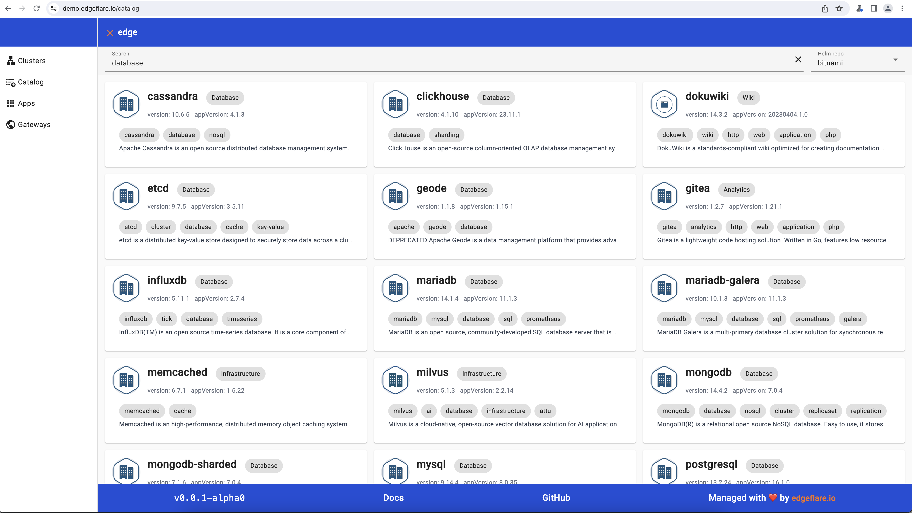
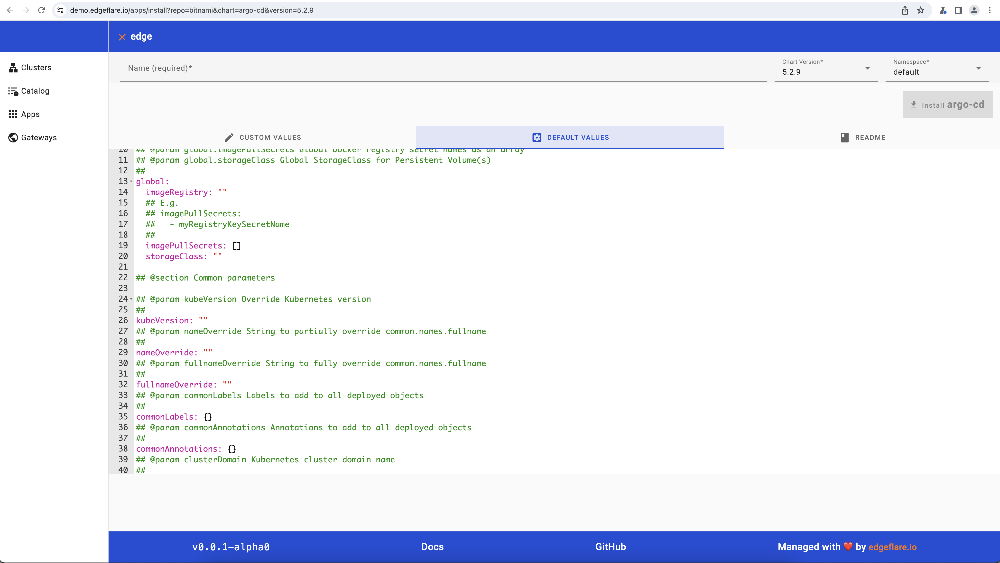
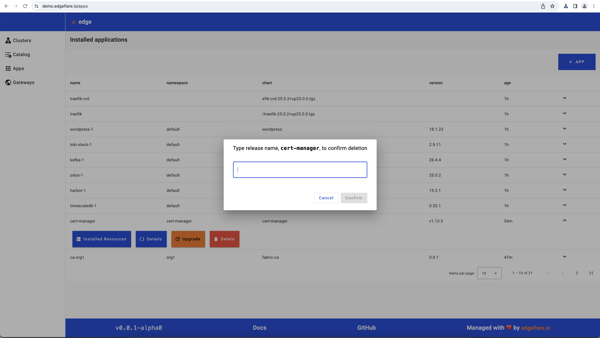
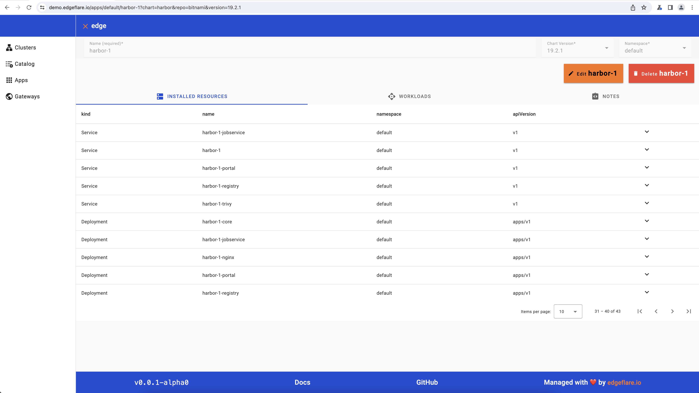
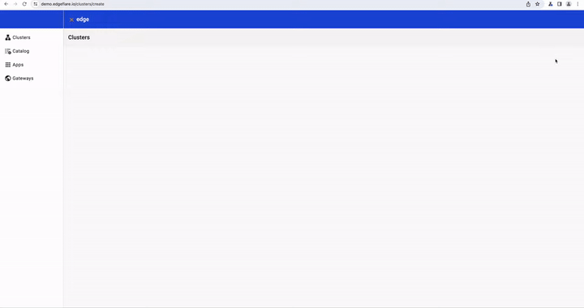

# containerized applications anywhere

[](https://pkg.go.dev/github.com/edgeflare/edge) [](https://goreportcard.com/report/github.com/edgeflare/edge) [](https://github.com/edgeflare/edge/actions/workflows/codeql-analysis.yml/badge.svg) [](https://github.com/edgeflare/edge/actions/workflows/golangci-lint.yml/badge.svg) [](https://github.com/edgeflare/edge/actions/workflows/goreleaser.yml/badge.svg)

## What can `edge` do for you?

- manage [k3s](https://k3s.io), aka lightweight-[kubernetes](https://kubernetes.io), clusters on local or remote computers
- manage [helm](https://helm.sh) packaged containerized apps
- expose applications to the Internet using [traefik](https://traefik.io), [cert-manager](https://cert-manager.io) and [letsencrypt](https://letsencrypt.org)
- authenticate users to applications using [dex](https://dexidp.io)

## Install `edge`

`edge` is a Go binary with an embedded web UI built with [Angular](https://angular.io/). It runs on Linux, Windows, macOS, and as container.

#### Run as container

```shell
docker run -p 8080:8080 edgeflare/edge
```

Optionally, supply: 
- `--volume $HOME/.kube/config:/workspace/.kube/config` for edge to use local kubeconfig
- `--volume $HOME/.ssh/id_rsa:/workspace/.ssh/id_rsa` for edge to use local SSH private key

#### Download binary

Get Linux, Mac and Windows binary from [Releases](https://github.com/edgeflare/edge/releases) page. Or

```shell
curl -sfL https://raw.githubusercontent.com/edgeflare/edge/master/install.sh | bash -
```

#### Install from source

```shell
git clone git@github.com:edgeflare/edge.git && cd edge
make build-linux-amd64 # make build-darwin-arm64, make build-windows-amd64
```

### WebUI

```shell
edge server # alias: s
# Web UI available at http://localhost:8080
# See edge s --help for more options
```

#### Explore readonly WebUI at [demo.edgeflare.io](https://demo.edgeflare.io)

##### manage helm-charts

|                                            |                                              |
|--------------------------------------------|----------------------------------------------|
|  |    |
|        |    |

##### install k3s cluster and join nodes

<p align="center">
  
</p>

## How to use `edge`?

> **Running privileged commands, eg, k3s on remote machines often requires sudo privileges without being prompted for a password. To verify or enable passwordless sudo access for a user on a remote SSH host, first, SSH into the host using `ssh yoursshuser@remotehost`. Then, use `sudo visudo` to edit the sudoers file and add or ensure line similar to below is present and correctly formatted. Most cloud VMs have this settup for root users.**

```shell
<yoursshuser> ALL=(ALL) NOPASSWD: ALL
```

Optionally, enable key-based auth instead of password

```shell
# ssh-keygen # if you dont have SSH private key, eg at, ~/.ssh/id_rsa
ssh-copy-id remote_user@remote_server_ip # run on workstation
```

### Install k3s using `edge`

```shell
edge k3s install --host 10.164.0.11 --user admin
# or use aliases eg cluster, c for k3s
edge c i -H 192.168.1.101 -u admin
```

Because the `k3s` commands are executed over SSH, `sshd` needs to be running on target host.
Addionally, for local installation (install k3s in the same machine as edge)
set `--host=LAN_IP` instead of 127.0.0.1 or localhost.

### Join k3s agent or server node to a cluster

```shell
edge c join --server 10.164.0.11 -H 10.164.0.12 -u admin
edge c j -s 10.164.0.11 -H 10.164.0.12 -u admin --master # server in HA mode
```

#### copy-kubeconfig from k3s server node

to `~/.kube/${SERVER_IP}.config`

```shell
edge c copy-kubeconfig -H 10.164.0.11 -u admin # alias: cpk
# Kubeconfig saved to /Users/<user>/.kube/10.164.0.11.config
```

#### minimal `kubectl` subcommand

`GET`. Supply resource argument in PLURALS, eg, `pods`, `namespaces`, `deployments`

```shell
edge kubectl get nodes
edge k g namespaces
edge k --namespace kube-system g pods
edge k -n kube-system --output yaml g helmcharts traefik-crd
```

`CREATE` resources

```shell
cat <<EOF | edge k create -f -
apiVersion: helm.cattle.io/v1
kind: HelmChart
metadata:
  name: grafana-test
  namespace: default
spec:
  chart: grafana
  repo: https://charts.bitnami.com/bitnami
  targetNamespace: default
  version: 9.6.5
EOF
# edge k apply -f chart.yaml
```

`DELETE` resources

```shell
edge k -n default delete helmcharts grafana-test
# edge k delete -f chart.yaml
```

#### query clusters and nodes in embedded sqlite3

```shell
edge c ls # list clusters
# ID              Status          Version         Is HA           APIserver       CreatedAt 
# b5fb728e341e    Running         v1.28.4+k3s2    false           10.164.0.11     2023-12-13T00:09:36Z

edge c nodes --clusterid b5fb728e341e # list nodes in a cluster
# Node ID         IP              Role            Status          CreatedAt 
# 33e37c119a90    10.164.0.11     server          Running         2023-12-13T00:09:36Z
# 443b2b12f320    10.164.0.12     agent           Running         2023-12-13T00:09:36Z
```

### Uninstall / destroy k3s

```shell
edge c destroy -H 10.164.0.11 -u admin # alias: uninstall
edge c d -H 10.164.0.12 -u admin -a # if agent node
```

## How to contribute to `edge`?

We welcome contributions to edge! If you're interested in helping improve this tool, please refer to our [CONTRIBUTING.md](CONTRIBUTING.md) for guidelines on how to get started.
